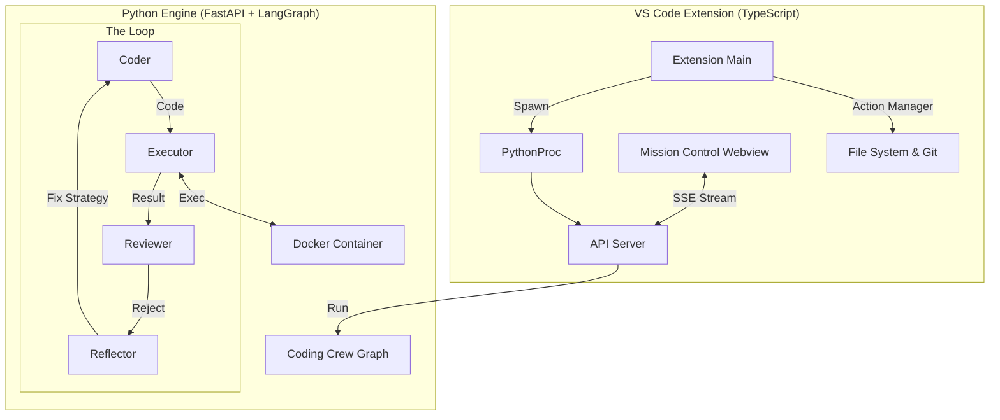

# 🚀 Swarm Engine (VS Code Edition)

**The "Frankenstein" AI Coding Engine** —— 融合了 **Aider** 的全知视角、**OpenDevin** 的持久化沙箱、**Roo Code** 的交互体验，以及 **LangGraph** 的深度思考能力。

Swarm 是一个寄生在你 VS Code 里的 **全自动编程生命体**。它拥有一颗基于 Python 的独立大脑，能够感知代码全局、在 Docker 容器中试错，并直接修改你的源文件。

---

## ✨ 核心特性 (Core Features)

### 1. 🧬 自我修正的 Coding Crew (The Brain)
我们内置了一个 **LangGraph** 状态机，形成完美的闭环：
* **Coder**: 编写代码或调用工具。
* **Executor**: 在 **Docker 沙箱** 中实际运行代码，捕获报错。
* **Reviewer**: 强制性的 JSON 格式代码审查。
* **Reflector**: 遇到错误时自动分析根因，生成修复策略，并指挥 Coder 重试。
> **注意**：它会一直尝试，直到代码跑通或达到最大重试次数！

### 2. 👁️ 上下文全知之眼 (The God's Eye)
* **Repo Map**: 利用 Tree-sitter 解析整个项目的 AST（抽象语法树），生成精简的代码骨架。AI 不需要读取所有文件就能理解复杂的项目结构。（*新增：大文件自动过滤与内存保护*）
* **RAG Memory**: 支持 `@Codebase` 指令，通过向量数据库检索相关代码片段。（*新增：持久化路径隔离*）
* **Deep Context**: 自动读取当前文件的光标位置、选区以及 **红色的波浪线报错**。

### 3. 🛡️ 永不消逝的沙箱 (The Immortal Sandbox)
* **Stateful Docker**: 容器启动后通过 `tail -f /dev/null` 保持常驻，支持连续的 Shell 会话。
* **Image Capture**: 甚至能运行 `matplotlib` 绘图代码，并将生成的图表直接传回 VS Code 聊天窗口。
* **Suicide Pact**: 如果 VS Code 主进程崩溃，Python 引擎会自动检测并自杀，防止僵尸进程。

### 4. ⚡️ MCP 风格的副作用 (The Hands)
* **XML Protocol**: 采用轻量级的 XML 协议调用工具 (`<tool_code>`)。
* **Safety First**:
    * **Git Checkpoint**: 每次写文件前自动创建 Git 提交，随时可以“后悔” (Undo)。非 Git 项目自动创建 `.bak` 备份。
    * **Diff Preview**: 像 Roo Code 一样，在写入前弹出一份漂亮的 Diff 对比视图供你审批。
    * **Secure Execution**: 所有 Shell 命令均通过 `spawn` 调用，杜绝命令注入。

### 5. 💰 实时成本监控
每次对话都会计算 Token 消耗，并根据 Gemini 费率实时估算美元成本，让你心中有数。

---

## 🏗️ 混合架构 (Hybrid Architecture)
本项目采用 **TypeScript (Host) + Python (Brain)** 的双进程设计：



---

## 📦 快速开始 (Quick Start)

### 前置要求
* **VS Code** v1.85+
* **Python** 3.10+ (请确保 `python` 或 `python3` 在 PATH 中)
* **Docker Desktop** (强烈推荐，用于启用沙箱功能；否则将降级为 Mock 模式)
* **Google Gemini API Key**

### 安装步骤
1.  克隆本仓库。
2.  下载 `vue.global.prod.js` 并放置于 `media/` 目录下（安全要求：本地加载）。
3.  安装 Node 依赖：
    ```bash
    npm install
    ```
4.  打包 Python 后端（这一步会将 Python 源码移动到 `dist/` 目录）：
    ```bash
    npm run package-backend
    ```
5.  按 `F5` 启动调试，或运行 `npm run package` 生成 `.vsix` 安装包。

### 配置
打开 VS Code 设置 (`Ctrl+,`)，搜索 `Gemini Swarm`：
* **Api Key**: 填入你的 Google Gemini Key (必需)。
* **Python Path**: 指定 Python 解释器路径 (插件会自动探测 `python3` 或 `python`)。

---

## ⚠️ 安全注意事项
* **Webview CSP**: 我们启用了严格的内容安全策略，禁止加载外部脚本（CDN）。
* **SSRF 防御**: `BrowserTool` 会拒绝访问内网 IP 地址。
* **命令执行**: 所有终端命令执行前均需用户点击确认。

---

## 🎮 使用指南 (Usage)

* 💬 **Mission Control (对话)**: 直接描述需求，例如："帮我写一个贪吃蛇游戏"。使用 `@Docs URL` 抓取在线文档。
* 💡 **一键修复 (Quick Fix)**: 当代码出现红色波浪线时，点击灯泡图标，选择 ✨ **Fix with Gemini Swarm**。AI 会自动读取报错并尝试修复。
* 🛠️ **终端命令**: AI 可以请求执行 Shell 命令（如 `npm install`）。你需要点击 "Approve" 按钮授权。
* ⏪ **时光倒流**: 觉得 AI 改乱了？执行命令 `Gemini: Undo Last AI Change`，瞬间回滚到修改前的状态。

---

## 📂 项目结构
```text
.
├── src/                  # TypeScript 宿主逻辑 (UI, Process, Actions)
│   ├── managers/         # 进程、Git、安全管理
│   └── views/            # Webview 实现
├── python_backend/       # Python 智能引擎 (构建后生成)
├── agents/               # LangGraph Agents (Coding Crew)
│   └── crews/coding_crew # 核心 Coding Crew 实现
├── core/                 # 核心库 (RepoMap, Sandbox, RAG)
├── tools/                # 工具集 (Docker, Browser, Search)
└── media/                # Vue 3 前端界面
```

---

## ❤️ Credits & Inspiration
本项目致敬并学习了以下开源项目的优秀设计：
* **Aider**: 代码地图 (Repo Map) 与 Chat-to-Edit 理念。
* **OpenDevin**: 强大的 Docker 沙箱实现。
* **Roo Code (Roo-Cline)**: XML 工具协议与交互式 Diff 界面。
* **Continue**: 上下文检索 (RAG) 与 IDE 集成体验。
